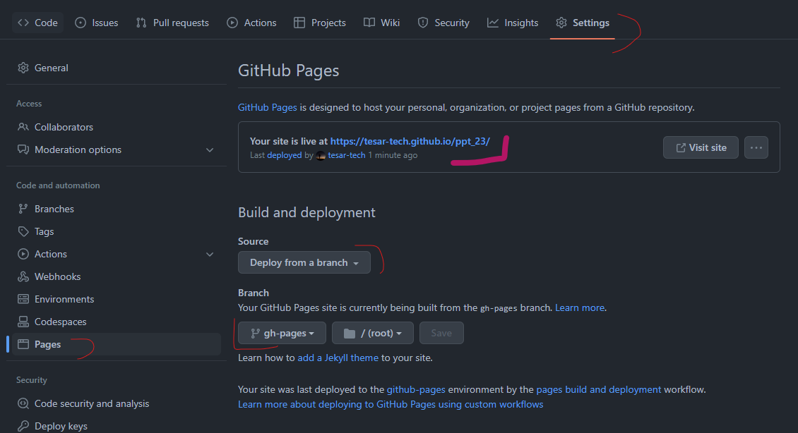
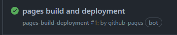
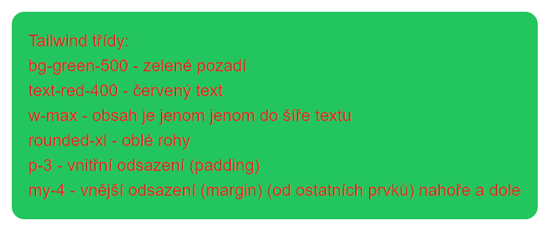

# 02 - CI/CD, Github actions, tailwindcss

Co se bude dít

- Nasadíme webovou aplikaci "do internetu".
- Jak funguje Blazor aplikace
- Stylování html s pomocí trailwind css

## GitHub actions

- Prostředí pro automatizaci (CI/CD)
- Ze začátku použijeme k sestavení (build) a nasazení aplikace (CD - continuous deployement).
  - V pozdějíšch cvičeních i k CI (continuous integration) - sestavení, testování, atd.
- Jednotlivé kroky a nastavení jsou definované v `.yml` souboru.
  - `yml`: využívá se ke konfiguraci. "`.json` bez závorek", umožňuje komentáře, kratší zápis, přehlednější, záleží na mezerách.  
- V repozitáři: Actions -> New workflow -> .NET (ale to je jedno, protože celý kód bude nahrazen:)
- Při každém pushnutí do větvě master se aplikace sestaví a publikuje a výsledek bude přidán do větvě gh-pages.
  - Což je zdrojový adresář webové aplikace
- Celý funkční soubor je níže. Jenom upravte řádky kam ukazují ☝️

```yml
# source: https://swimburger.net/blog/dotnet/how-to-deploy-aspnet-blazor-webassembly-to-github-pages
# source: https://dev.to/madhust/how-to-publish-blazor-webassembly-application-to-github-pages-using-github-action-54h4
name: Sestavit a nasadit apku # název - nezáleží na něm 

on:
  push:
    branches: [ master ] # když je push na větvi master
    # změnit na  ☝️  main (vaši hlavní větev)
env: #proměnné, které můžeme používat dále pomocí env.PUBLISH_DIR
  PUBLISH_DIR: vystup #výstupní složka kam se vybuildí aplikace (tuhle složku to vytvoří, na názvu nezáleží)
  
  
jobs:
  deploy-to-github-pages:
    runs-on: ubuntu-latest # use ubuntu-latest image to run steps on
    steps:
    # uses GitHub's checkout action to checkout code form the master branch
    - uses: actions/checkout@v3 # zpřístupní nám zdroják v repu
    - name: Nastavení .NET # stáhneme a nastavíme dotnet (není součástí základní instalace ubuntu)
      uses: actions/setup-dotnet@v1 #externí "action", její zdroják je https://github.com/actions/setup-dotnet
      with:
        dotnet-version: 6.0.x #verze
    - name: Publish with dotnet #do určené složky publikuje aplikace, v release configuraci
      run: dotnet publish 02/Ppt23.Client.sln --configuration Release --output ${{env.PUBLISH_DIR}}
      # ☝️ Upravte dle názvu vašeho .sln

    # změní tag base v index.html from '/' na 'ppt_22' což je gh page k tomuto repu
    - name: Change base-tag in index.html from to your gh repo
      run: sed -i 's/<base href="\/" \/>/<base href="\/ppt_23\/" \/>/g' ${{env.PUBLISH_DIR}}/wwwroot/index.html
      # ☝️ Upravte  dle názvu vašeho repozitáře

      
    # přidá .nojekyll, čímž říká gh pages, že toto není jekkyl projekt (jinak to nedovolí soubor s podtržítkem)
    - name: Add .nojekyll file
      run: touch ${{env.PUBLISH_DIR}}/wwwroot/.nojekyll      
      
    # tato akce zařídí přenesení obsahu wwwroot složky to samostatné větve s názvem gh-pages
    # posléze je nutné nastavit v Settings -> Project větev gh-pages jako zdroj pro stránky
    - name: Commit wwwroot to GitHub Pages 
      uses: JamesIves/github-pages-deploy-action@v4.2.5
      with:
        GITHUB_TOKEN: ${{ secrets.GITHUB_TOKEN }} #token, který umožní manipulaci s repem (jako např. vytvoření větve gh-pages)
        BRANCH: gh-pages
        FOLDER: ${{env.PUBLISH_DIR}}/wwwroot #tady máme vypublikovanou celou aplikaci a ta bude v kořenovém adresáři ve větvi gh-pages
        #obsahuje například soubor index.html, který se použije k načtení celé stránky.
```

## GitHub Pages

- Umožňuje na určité adrese hostovat statické stránky z gh repozitáře.
- Stárnky už máme ve větvi gh-pages
- V nastavení repa říct gh z jaké větve chceme stránky hostovat:



- Po nasazení na gh-pages by se měla rozjet druhá action, která se postará o samotné zpracování a nasazení.



- Tadá, stránky běží

## Edit Readme.md

- Jestli nemáte, přidejte do rooto vašeho rezpozitáře soubor README.md
  - tento soubor se ukáže jako obsah stránky když vstoupíte na githubu na repozitář
  - Funguje to tak pro každou složku (a v ní soubor readme.md)
- přidejte odkaz na běžicí aplikace

## 404 a neznámé stránky 

- Jak fungují SPA a jak řeší cesty
- přístup na /hra napřímo

```yml
      # zkopíruje index.html do 404.html který je předložen, kdykoliv vstoupíme na stránku, která neexistuje
    - name: copy index.html to 404.html
      run: cp ${{env.PUBLISH_DIR}}/wwwroot/index.html ${{env.PUBLISH_DIR}}/wwwroot/404.html
```

## CSS, Bootstrap, Tailwind CSS

### CSS

- Jednoduše můžete ostylovat element přidáním vlastnosti `style`:

```html
<h1 style="background-color:red">Vítej v nemocnici!</h1>
```

- S přibývajícím množstvím úprav se to stává nepřiměřeně komplikované. Navíc není možné znovu použít jeden styl.
- Řešením je odhrnout stylování do samostatného souboru (.css - cascading style sheet) a použít nějaký ukazatel (třídu)

```html
<h1 class="nadpis">Vítej v nemocnici!</h1>
```

.css soubor:

```css
.nadpis
{
    background-color:red;
}
```

### Bootstrap

- Rozumné množství opakujících se znovupoužitelných tříd.
- https://getbootstrap.com/docs/5.0/components/buttons/
- Například třídy pro tlačítko: `btn btn-primary` (tyto 2 třídy skrývají cca 20 vlastností, viz F12)
- Zařídí podporu pro všechny* prohlížeče
  - Klasicky ne všechny css vlastnosti jsou u všech prohlížečů stejně implementovány.
- Výrazně zjednodušuje práci především pro ne-frontendisty. Vypadá to přibližně dobře.
- Lehce omezující. Pokud chcete něco trochu jiného, je nutné sáhnout k vlastním třídám (na tom není nic špatného)
- příklad červeného pozadí: 

```html
<h1 class="bg-warning">Vítej v nemocnici!</h1>
```

- podpora pro responzivní design. (na telefonu to vypadá jinak než na monitoru) 

### Tailwind CSS

- Stejně jako Bootstrap má velké množství tříd.
- Třídy však nejsou omezující (je jich daleko víc), můžete mít skoro všechny vlastnosti z css
- Ve výsledném css máte jenom ty, které používáte.
  - A ty co nemáte se dají doplnit chytrým způsobem
- Nenutí žádný styl.¨
- Také prohlížečová kompatibilita
- Více ukecané. Nemáte třídu přímo pro tlačítko.
- Trochu se tím kruh uzavřel a je to možné vnímat jako návrat k psaní stylů do elementu:

```html
<h1 class="bg-red-500">Vítej v nemocnici!</h1>
```

Modré tlačítko:

```html
 <button class="p-2 pl-5 pr-5 bg-blue-500 text-gray-100 text-lg rounded-lg focus:border-4 border-blue-300">Primary</button>
 ```

- Dnes (verze3) je možné všechno napsat bez tvorby vlastních tříd (někdy se to ale hodí napsat si svoje).
- Výborná dokumentace:  https://tailwindcss.com/
- Výborný online nástroj na prototypování: https://play.tailwindcss.com/

#### Jak dostat Tailwind do Blazoru

- Nejjednodušší pomocí cdn do index.html: `<script src="https://cdn.tailwindcss.com"></script>`
- Takto můžete využívat jakokoliv trailwind třídu.
- Pro produkční prostředí není `cdn` doporučená.
  - Fungovat ale bude
  - Proces posléze není příliš složitý

#### Tailwind - jednoduchý příklad

```html
<div class=" bg-green-500 text-red-400 w-max rounded-xl p-3 my-4">
```



## Jak Blazor aplikace funguje?

### Všechno začíná v souboru `index.html`

- neplést s `Index.razor`.
- statický soubor, který je načten při startu aplikace (/index je to samé jako / )
- v elementu `<head>` načítá csska, nastavuje titulek, meta tagy, atd...
- vlastní stránka je v elementu `<body>`
- v `<body>` jsou i skripty. Pro běh Blazor aplikace je důležité načíst:

```html
<script src="_framework/blazor.webassembly.js"></script>
```

- `blazor.webassebly.js` je zodpovědný za načtení `.dll` souborů a spuštění .net aplikace. Ve finále vymění obsah divu: `<div id="app">` za komponentou `App.razor`

### App.razor - startovací bod pro běh aplikace

- Obsahuje komponentu `<Router>`, s vlastností `AppAssembly="@typeof(App).Assembly"` -> "V sestavení (assembly) stejného typu jako je třída `App` hledej stránky".
- Když stránku nalzne (například `/counter`), zobrazí se `RouteView` (v podstatě stránka (komponenta obsahující direktivu `@page`(`Index.razor`,`Counter.razor`)))
- Když stránka nalezena není. Zobrazí se to co je v komponentě `<NotFound>`.
- `RouteView` má vlastnost `DefaultLayout="@typeof(MainLayout)"`. Čímž nám říká, že pro zobrazení stránek se použije layout `MainLayout.razor`.

### Program.cs

- První c# kód, který se spustí po načtení.
- Obsahuje nastavení celé aplikace. 
  - `builder.RootComponents.Add<App>("#app");` -> vyměň element s `id=app` za komponentu typu `App`.
- Všimněte si zjednodušení c# syntaxe (většinou novinka z .net 6 a c# 9/10)
  - Top level namespace; class, metoda main
  - (za oponou je všechno přidáno do Main metody třídy Program (ale nejmenují se tak ))
  - https://docs.microsoft.com/en-us/dotnet/core/tutorials/top-level-templates
  - https://code-maze.com/csharp-top-level-statements/


### MainLayout.razor

- Obsahuje rozložení stránky (levý sloupec s navigací, hlavičku (header neplést s `<head>`) ).
- Vlastnost `@Body` -> Tam se vygeneruje stránka na kterou uživ. vstoupil.
- Umožňuje mít stejný Layout, aniž byste neustále opakovili stejné prvky. 

### Úlohy

- Změňte favicon na jakýkoliv (vámi zvolený ) `<link rel="icon" type="image/x-icon" href="jakýkolivObrázek.png">`
- Vytvořte jednoduché menu - buď nahoře nebo na straně aplikace (využijte layout)
- Přidejte odkaz  FBMI odkazující na fakultní web.
- Přidejte stránku `Vybavení nemocnice` a společně s ní i odkaz do menu.
  - (Zde budeme posléze seznam vybavení nemocnice)
- Změňte text `Loading…` na něco jiného.
- Pokud uživatel vstoupí na stránku, kterou aplikace nemá. Zobrazte chybovou hlášku a přidejte odkaz na návrat na index. 
- Na index napište uvítací zprávu
- Dejte tomu celému nějaký nastylovaný nádech. 

