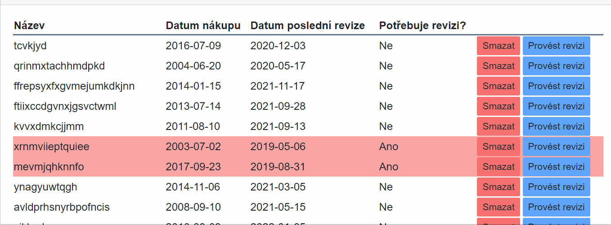

# 03 - Layout, F12, Flexbox, Grid, Vybavení, Razor Components

> DRAFT !!!
## Base tag

- Slouží k nastavení relativních odkazů
  - (v <head> v index.html)
- díky tomu vám stránky poběží na github pages, stejně tak jako na localu
  - na gh pages stránky končí /repo_name - což je přesně ta relativní část
- <base href="repo_name"> se mění jenom na gh pages 
  - proto daný task v gha (github action)

## Tailwind play

- https://play.tailwindcss.com/
- umožňuje rychle prototypovat.
  - Nápověda tříd
  - okamžité zobrazení výsledku
- Arbirtary values

## Layout

```html
<div id="app " class="flex flex-col items-center">
<header class="bg-green-400 flex flex-col sm:flex-row justify-between w-full">
  <div class="bg-pink-500  px-3">
    Logo goes here here
  </div>
  <nav class="bg-blue-400 flex-1 flex justify-evenly">
    <a>helou</a>
    <a>helou</a>
    <a>helou</a>
  </nav>
</header>
<main class="bg-amber-400 sm:max-w-md w-full">
<div>
  Something in main
</div>
</main>
</div>
```

## F12

- Nástroje pro vývojáře v prohlížeči.

## CSS Grid

- Grid je sourozenec od flexboxu.
- Spíš pro 2D layouty (ale tohle neplatí na 100 %)
- Vždy udržuje "mřížkovitost"
  - specifikuje se počet sloupců (nebo řádků) a grid se postará
- Vymakanější <table>, ale nedá se 100 % zaměnit.
  - table vs grid. 

```html
 <div class="grid bg-violet-500 grid-cols-3 gap-x-2 gap-y-1  ">
   <div class="bg-red-400 w-full h-full text-center">Whatever</div>
   <div class="bg-red-400 w-full h-full">smting elz</div>
   <button class="bg-gray-500 rounded-md mx-2 my-1">Butón</button>
     <div class="bg-red-400 w-full h-full text-center">Whatever</div>
   <div class="bg-red-400 w-full h-full">smting elz</div>
   <button class="bg-gray-500 rounded-md mx-2 my-1">Butón</button>
 </div>
```


## VybaveniVm

- vytvořte si složku `ViewModels`
- přidejte třídu `VybaveniVm`
- Třída `VybaveniVm` má tyto vlastnosti (odpovídají sloupečkům v tabulce):
  - Name (string)
  - BoughtDateTime (DateTime)
  - LastRevisionDateTime (DateTime)
  - IsRevisionNeeded (bool) - vlastnost bez settru. True v případě, že poslední revize je starší než 2 roky.

## Vybavení nemocnice

- Vytvořte seznam vybavení, tak aby fungoval přibližně takto: 



- Seznam vybavení je `List` (nebo pole) typu `VybaveniVm`. Tuto třídu musíte nejdřív přidat do projektu.
- Použijte na layout Grid

    - Odpovídající sloupec má červené podbarvení pokud je revize třeba.
- V posledním sloupci jsou tlačítka:
  - Smazat: Smaže prvek ze seznamu
  - Provést revizi: nastaví datum poslední revize na dnešek
- Součástí úlohy je i vytvořit generátor dat (jak čísel, tak textů)
- Řádek si dejte do komponenty


## Razor komponenty

- Opakující se kód je vhodné dát do komponenty
- Dají se tak oddělit logické kusy kódu a zvýšit přehlednost.
- razor komponenta je to samé co stránka, jenom bez direktivy `@page`
- pak se použije jako běžný html tag.
- Dá se komunikovat oběma směry
  - Z mateřské do potomka
  - Z potomka do mateřské
- Parameter
- RenderFragment - kód který se mění per instance komponenty


## Vybavení nemocnice

- Vytvořte seznam vybavení, tak aby fungoval přibližně takto: 


- Seznam vybavení je `List` (nebo pole) typu `VybaveniData`. Tuto třídu musíte nejdřív přidat do projektu.
- Použijte na layout Grid
- Třída `VybaveniData` má tyto vlastnosti (odpovídají sloupečkům v tabulce):
  - Name (string)
  - BoughtDateTime (DateTime)
  - LastRevisionDateTime (DateTime)
  - NeedsRevision (bool) - vlastnost bez settru. True v případě, že poslední revize je starší než 2 roky.
    - Odpovídající sloupec má červené podbarvení pokud je revize třeba.
- V posledním sloupci jsou tlačítka:
  - Smazat: Smaže prvek ze seznamu
  - Provést revizi: nastaví datum poslední revize na dnešek
- Součástí úlohy je i vytvořit generátor dat (jak čísel, tak textů)
- Řádek si dejte do komponenty

## EventCallBack -> Volání nadřazené komponenty

- Nyní k zakomentovanému řádku, který maže itemu ze seznamu.
- Problém je v tom že v komponentě `VybaveniRow` nemáme `seznamVybaveni`.
- Můžeme ho tam poslat v parametru. Avšak komponenta by se měla soustředit pouze na jeden řádek (podle toho se jmenuje) a navíc bychom stejně potřebovali aktualizovat celý seznam (z rodičovské komponenty, o tom později).
- Řešením je vytvořit EventCallback -> zavolat rodičovské komponentě a říct ji: "Tato itema chce být smazána, poraď si s tím".

```csharp
[Parameter] public EventCallback<VybaveniVm> DeleteItemCallback { get; set; }
```

A jeho použití:

```razor
<button @onclick="() => DeleteItemCallback.InvokeAsync()">
```

- Tímto se ale nic nesmaže. Jenom tím dáváme možnost rodičovské komponentě reagovat na takovéto volání. Položku smažeme takto:

```razor
<VybaveniRow Item=item DeleteItemCallback="() => seznamVybaveni.Remove(item)" />
```
