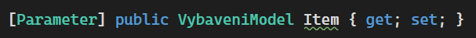
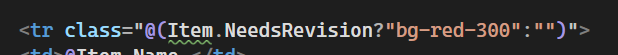
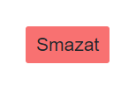
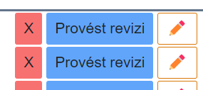
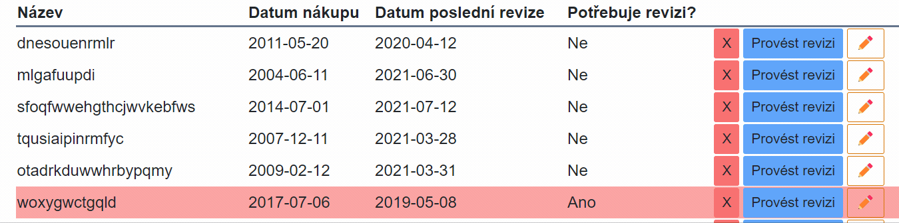
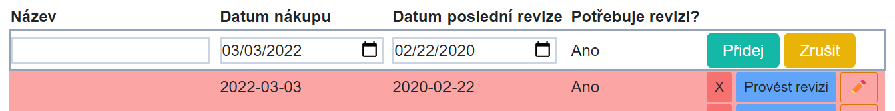

# 04 - Null reference Warning, Tailwind config, editace záznamnu, validace dat, formuláře

## Null reference Warning

- V C# 9/10 se daleko lépe pracuje s referenčními typy a jejich "nullabilitou".
- Klasicky referenční typu mohou být null, což často způsobuje problémy při běhu programu (klasicky Null reference exception).
- NullRefference warningy vás upozorní na to, že se to může stát. Běžně jsou to tyto zelené podtrženosti:



S textem: `Non-nullable property 'Item' must contain a non-null value when exiting constructor. Consider declaring the property as nullable`

- Takto zkonstruovaná properta je nastavená jako Non-nullable (nullable by byla s otazníkem `VybaveniVm? Item `).
  - Kód fungovat bude (je to jenom warning)
  - Ve starších C# verzích to problém "nebyl" (problém to byl, ale neukazovalo to warning)
  - Kontruktor žádný nemáme (takže tam ani nenastavujeme hodnotu `Item`)
- Řešením (špatným) je nastavit nějakou defaultní hodnotu, například:

```csharp
[Parameter] public VybaveniVm Item { get; set; } = new();
```

- Toto řešení ☝️ je ale špatný nápad. Zbytečně vytváříme novou instanci. Properta `Item` si čeká na to co ji přijde z foreache, nepotřebuje tam nic předtím.
- Další řešení je nastavit `Item` aby mohla přijmout null. Tedy udělat ji nullable, tak jak radí warning: `...Consider declaring the property as nullable`

```csharp
[Parameter] public VybaveniVm? Item { get; set; }
```

- Tento warning zmlknul, ale objevil se nový na místě, kde se snažíme použít `Item`.



- S hláškou `Dereference of a possibly null reference`. V případě, že by byla `Item` null, a my se snažili vyčíst nějakou hodnotu (`IsRevisionNeeded` v tomto případě), kód pojde na Null reference Exception (což je věc, které se snažíme celou dobu vyvarovat).
- řešením je vůbec kód v takovém případě nespustit: 

```razor
@if (Item == null) return;//někde před použitím Item
```

- Celé to může působit jako zbytečná otrava, ale věřte mi, že trocha práce s nullabilitou v předstihu ušetří spoustu času (který byste jinak trávili odstraňováním NullReferenceException).

## Tailwind - defaultní styl tlačítka

- Abychom nemuseli neustále opakovat ty samé vlastnosti pro každé tlačítko, přidáme základní - znovupoužitelný styl.
- Do index.html do tagu `<head>` přidejte:

```html
  <style type="text/tailwindcss">
        @layer components {
            .twbtn {
                @apply py-1.5 px-4 text-center text-white hover:opacity-80 hover:text-neutral-100 rounded-md focus:ring-2 focus:ring-opacity-75 focus:outline-none;
            }
        }
    </style>
```

- teď můžeme zkrátit zápis na:

```razor
<button @onclick="() => DeleteItemCallback.InvokeAsync()" class="twbtn bg-red-400">Smazat</button>

```



- Přidávat `<style>` do html stránky není úplně správně (všechno css by mělo být v .css souborech). Nicméně to vychází z potřeby použít tailwind cdn (které je určeno pouze pro testování). Díky cdn jsme si ušetřili pár kroků při nastavování a pohodlí z toho plynoucí za kousek "bad practice" v tomto případě stojí.


## Úprava vybavení (začátek)

- Přidejte tlačítko pro editaci záznamu.



- Toto tlačítko přehodí aktuální záznam do editačního módu.
  - Vytvořte ve view modelu vlastnost `IsInEditMode`
  - Po kliknutí na tlačítko se změní na true.
- V případě, že je záznam v edit módu, tak se místo výpisu textů (a datumů) zobrazí textová pole.
- Nyní je řádek ve stavu, kdy se po kliknutí na tlačítko změní vlastnost `IsInEditMode`. (ale nic se s tím neděje)
- Vytvořte editační vzhled v závislosti na `IsInEditMode` vlastnosti: `@if(!item.IsInEditMode)`
- Využijte `<input type="text" @bind-value=@item.Name/>`
  - `@bind-value` je dvoustranný (Two-way) binding, což zajistí propsání textu z textového pole do proměnné `item.Name`.
    - Jednostranným bindingem `Vale=item.Name` by se docílilo pouze vypsáním "staré" hodnoty `item.Name` do textového pole.
- Podobně vytvořte pole pro editaci datumů. UI pro editaci data (kalendář) je v závislosti na implementaci každého prohlížeče jiný. 
- `IsRevisionNeeded` se přímo upravovat nedá, je dopočítán z datumů. 
- Odstraňte tlačítko pro smazání a revizi. Editovací tlačítko nahraďte textem "Ok". (v průběhu editace)
- Poznámka: Kdybychom chtěli implementovat tlačítko "Zrušit změny" museli bychom si původní stav nejprve uložit (což budeme dodělávat posléze)



- Tímto značně naroste velikost kódu. I proto je vhodné mit kód v kompnentě.


## Validace formulářů + možnost zrušení editace (pkračování úpravy vybavení)

## Dlaší zdroje


- [Návod základní validace](https://blazor-university.com/forms/validation/) (podobné s místním vysvětlením)
- [Práce s formuláři](https://blazor-university.com/forms/handling-form-submission/)
- [Video vysvětlující validaci z technického pohledu](https://knowledge-base.havit.cz/2022/01/17/blazor-validace-formularu-jiri-kanda-vzdelavaci-okenko-2-6-2021/) (CZ, 68 minut)

Validací, kterou se zde zabýváme se jmenuje Data Annotation Validation. Využívá totiž anotací dat pomocí atributů. Takováto validace je velmi jednoduchá na implementaci, není však všemocná. Pro pokročilejší scénáře je dobré používat Fluent validation (vypadá to například takto: `RuleFor(p => p.Name).NotEmpty().WithMessage("You must enter a name");`). Více příkladů a návod jak to dostat do Blazoru (standartně se používá v C# na backendu) je [zde](https://chrissainty.com/using-fluentvalidation-for-forms-validation-in-razor-components/).

> V příštích lekcích budeme do aplikace přidávat serverovou část, která bude data přijímat a ukládat do databáze. Je vhodné říct, že jakákoliv validace, kterou podstoupí data na klientovi (ve webovém prohlížeči), je možné obejít a na server poslat data nevalidní. Je proto nutné validaci provádět znovu na serveru. Žádná data, která přicházejí z klienta není možné považovat za bezpečná a vždycky musíte uvažovat o uživateli jako někom, kdo chce vaší aplikaci "narušit". (píšu to už sem, jelikož je skutečně dobré si tento mindset co nejdříve osvojit).


- Omezení vstupních dat pouze na validní hodnoty.
- Aktuální stav aplikace umožňuje vstup jakékoli hodnoty (i prázdné).
- Validace má několik úrovní
- Aplikace musí být schopna vrátit stav do needitované (validní) formy
  - Nyní se změny dějí přímo na objektu (což je problém)
  - Vyžaduje výraznější úpravu

### HTML Formuláře

- Element `<form>`. Umožňuje pracovat se vstupními hodnotami (element `<input>`).
- Při stisknutí tlačítka, které je uvnitř formuláře se formulář "Odešle" (Submit)
  - Na to musí být navázána nějaká akce/url
- V Blazoru obhospodařeno pomocí komponenty `EditForm`

### EditForm

- Vyrenderuje se jako `form`.
- Umožňuje kontrolovat validaci vstupů (vnořená komponenta `<DataAnnotationsValidator/>`)
  - Spolupracuje s Modelem (VybaveniVm) a [Atributy](https://docs.microsoft.com/en-us/dotnet/csharp/programming-guide/concepts/attributes/).

- Editační komponenty musíme umístit do `EditForm`

```razor
        <EditForm Model=editingItem OnValidSubmit="() => TurnOffEdit(true)">
            <DataAnnotationsValidator />
            <ValidationSummary />
              <InputText class="border-2 border-slate-300" @bind-Value=@editingItem.Name />
```

- `Model=editingItem` - vlastnost `Model` nastavuje proměnnou, kterou má formulář validovat. Je stejného typu jako Item (`VybaveniVm`).
  - Důvodem, proč tam není `Item` je právě možnost zrušení editace (hodnoty se pak kopírují z `Item` do `editItem` a obráceně). Vyřešíme dál.
- `OnValidSubmit` nastavuje co se stane, když formulář bude "odeslán" (stisknuto tlačítko) a data nastavená v `Model` budou validní (alespoň 5 znaků na jménu). Toto nám ušetří dost práce oproti "ruční" validaci.
  - Míří to na metodu `TurnOfEdit`, (vytvořte ji nyní, implementaci doděláme).
- Místo `<input>` jsme použili komponentu `InputText`, právě z důvodu spolupráce s `EditForm` a `DataAnnotationsValidator`. `InputText` je zodpovědný za vlastní validaci (vyhmátne ji z atributů) a zobrazení jejího výsledku ve formě css třídy).
  - @bind-Value má velké "V". `Value` je název vlastnosti uvnitř `InputText` komponenty.
  - vyrenderuje se jako `<input>`
- Stejnou změnu udělejte i u ostatních vstupů

### DataAnnotation - Atributy určené k anotaci dat

- Například chceme zmínit, že dané pole `Name` je povinné.
- Také musí mít délku alespoň 5 znaků.
- Chybovou hlášku můžeme libovolně změnit:

```csharp
[Required,MinLength(5,ErrorMessage = "Délka u pole \"{0}\" musí být alespoň {1} znaků")]
[Display(Name = "Název")]
public string Name { get; set; } = "";
```


## Validace dat

- Přidejte modelu vlastnost "Cena" (pro zjednodušení to bude `int`). Zobrazte cenu v tabulce.
- Přidejte validaci. Cena nesmí být záporná a její maximum je 10 000 000.
  - Přidejte správné validační zprávy
  - Využijte komponentu `<ValidationMessage` a zobrazte validační zprávy vždy u daného pole (tedy pro jméno a cenu).

## Úpravy na editItem

- Úpravy se budou provádět na proměnné `editItem`
- Potřebujeme mechanismus jak zjistit, že se `Item` má upravovat

```csharp
VybaveniVm? _Item;
[Parameter]
public VybaveniVm? Item
{
    get => _Item;
    set
    {
        _Item = value;
        if (value != null && value.IsInEditMode)
            TurnOnEdit();
    }
}
```

- pokaždé, když se nastavuje `Item` a je otevřena v editačním módu, tak zavoláme metodu `TurOnEdit`
- Tu také voláme na tlačítku Edit:

```razor
<button @onclick="() => TurnOnEdit()" class="border-[1px] border-amber-600 rounded-sm text-sm px-2 py-1">✏️</button>
```

- Její implementace:

```csharp
private void TurnOnEdit()
{
    if (Item != null)
    {
        Item.IsInEditMode = true;
        editingItem = Item.Copy();
    }
}
```

- Zapne se `IsInEditMode` (v případě že není, což je při kliknutí na tlačítko) a do `editingItem` se zkopírují hodnoty vlastností:

```csharp
//VybaveniVm třída
  public  VybaveniVm Copy()
    {
        VybaveniVm to = new();
        to.BoughtDateTime = BoughtDateTime;
        to.LastRevision = LastRevision;
        to.IsInEditMode = IsInEditMode;
        to.Name = Name;
        return to;
    }
```

- Vlastnosti nelze zkopírovat s pomocí `editingItem = Item`. To by obě proměnné referencovali stejný objekt (takže by se při změně `editItem.Name` změnilo i `Item.Name`). My chceme vytvořit nový objekt.

- Změníme podmínky, jestli ukazovat `Item` nebo `editItem` (v závislosti na tom, jestli se proměnná naćhází v editačním modu)

```razor
@if (Item != null && !Item.IsInEditMode)
{...}
else if (editingItem != null && editingItem.IsInEditMode)
{...}
```

- Vypnutí editačního módu (volám při kliknutí na tlačítko Ok nebo při `OnValidSubmit`):

```csharp
private void TurnOffEdit(bool success)
{
    if (success)
    {
        editingItem?.MapTo(Item);
    }
    if (Item is not null)
        Item.IsInEditMode = false;
    editingItem = null;
    EditDoneCallback.InvokeAsync(success);
}
```

- `success` nám řekne, jestli byla akce potvrzená (Ok, true) nebo zrušená (Zrušit, false). V případě true, se namapují hodnoty vlastností zpět na `Item`:

```csharp
//VybaveniVm třída
public void MapTo(VybaveniVm? to)
{
    if (to == null) return;
    to.BoughtDateTime = BoughtDateTime;
    to.LastRevision = LastRevision;
    to.Name = Name;
}
```

- V metodě `TurnOffEdit` se aktivuje `EditDoneCallback`, pomocí něhož řekneme rodičovské komponentě, jestli se něco změnilo nebo ne. Toho využijeme především pro přidání nového řádku (`Vybaveni.razor`):

```razor
<VybaveniRow EditDoneCallback="(success) => { if(success)seznamVybaveni.Insert(0,newModel); isInNewMode = false; }" Item=newModel>
    <button  class="twbtn bg-teal-500">Přidej</button>
    <button type="button" @onclick="() => isInNewMode = false" class="twbtn bg-yellow-500">Zrušit</button>
</VybaveniRow>
```

- Taky byla odebrána akce na tlačítku "Přidej". Automaticky se bude snažit submitnout formulář, tento pokus se odchytí v `OnValidSubmit` (nebo se ukáže hláška validace)
- Na tlačítku zrušit jsme přidali vlastnost `type="button"`. Defaultně mají tlačítka `type="submit"`, takže by se rušící tlačítko odesílalo formulář. 

## Nový záznam


- Přidejte tlačítko pro přidání nového záznamu.
- Vytvořte proměnnou `isInNewMode` (ve `Vybaveni.razor`). Tlačítkem změníte hodnotu.
- V případě, že je hodnota `isInNewMode` false, tak je zobrazeno tlačítko
- V případě, že je hodnota true, tak se přidá nový řádek do tabulky a v tom otevřený záznam.
  - Tento řádek bude ve skutečnosti použití komponenty `VybaveniRow`. Toto je druhý dobrý důvod proč komponentu používat (první byl, že se kód neplete na jednom místě => je přehlednější). Pro stejnou (podobnou) věc (editace záznamu v tomto případě) není nutné psát kód znovu, ale stačí využít existující komponentu.
  - Na začátek nastavte tomuto záznamu dnešní datum.
  - Dále přidejte 2 tlačítka - jedno pro přidání a druhé pro zrušení.
- Záznam přidejte na začátek seznamu

## RenderFragment a ChildContent -> Jak z vnějšku ovlivnit komponentu

- Znovu využití komponenty s sebou nese i pár nástrah. Například by bylo vhodné, kdyby tlačítka u nového záznamu měla text "přidej" místo "Ok/Uprav"
- Pomocí property typu `RenderFragment` je možné vyrendrovat určitou část komponenty, která se mění z vnějšku. 

```csharp
[Parameter] public RenderFragment? ChildContent { get; set; }
```

- Vlastnost typu `RenderFragment` se v tomto případě jmenuje `ChildContent`. Je možné je využít následujícím způsobem:

```razor 
<VybaveniRow Item=newModel>
    <button @onclick="() => {seznamVybaveni.Insert(0,newModel); newModel.IsInEditMode = false; isInNewMode = false;}" class="twbtn bg-teal-500">Přidej</button>
    <button @onclick="() => isInNewMode = false" class="twbtn bg-yellow-500">Zrušit</button>
</VybaveniRow>
```

- ChildContent jsou v tomto případě tlačítka. Kam se v komponentě `VybaveniRow` vyrenderují záleží na umístění `@ChildContent`.

```razor
 @if (ChildContent == null)
 {
     <button @onclick="() => Item.IsInEditMode = false" class="border-[1px] border-amber-600 rounded-sm text-sm px-2 py-1">Ok</button>
 }
 else
 {
     @ChildContent
 }
```

- Pokud je `ChildContent` null (nic mu nebylo nastaveno), tak se přidá tlačítko "Ok". V případě, že nějaký `ChildContent` existuje, tak se vypíše ten.



- (Poznámka) Název ChildContent není povinný. V případě potřeby je možné mít vícero RederFragment vlastností (a všechny se nemohou jmenovat ChildContent). Nicméně s názvem ChildContent je možné psát HTML rovnou to tagu komponenty. V případě:

```csharp
[Parameter] public RenderFragment? NecoUvnitr { get; set; }
```

je nutné uvést otevírací i zavírací tag fragmentu:

```razor 
<VybaveniRow Item=newModel>
  <NecoUvnitr>
    <button @onclick="() => {seznamVybaveni.Insert(0,newModel); newModel.IsInEditMode = false; isInNewMode = false;}" class="twbtn bg-teal-500">Přidej</button>
    <button @onclick="() => isInNewMode = false" class="twbtn bg-yellow-500">Zrušit</button>
  </NecoUvnitr>
</VybaveniRow>
```