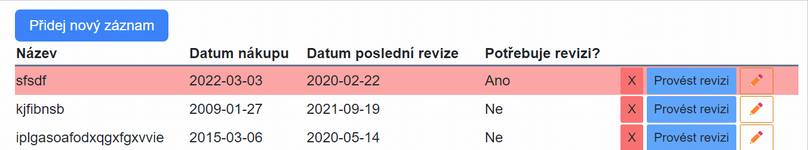
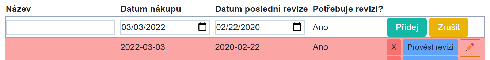

# 05 - Nový záznam, Nový záznam, RenderFragment a ChildComponent

> DRAFT !!!

## API 

## Nový záznam

Co se bude dít s aplikací:

- Přidáme tlačítko pro přidání nového záznamu


## Nový záznam



- Přidejte tlačítko pro přidání nového záznamu.
- Vytvořte proměnnou `isInNewMode` (ve `Vybaveni.razor`). Tlačítkem změníte hodnotu.
- V případě, že je hodnota `isInNewMode` false, tak je zobrazeno tlačítko
- V případě, že je hodnota true, tak se přidá nový řádek do tabulky a v tom otevřený záznam.
  - Tento řádek bude ve skutečnosti použití komponenty `VybaveniRow`. Toto je druhý dobrý důvod proč komponentu používat (první byl, že se kód neplete na jednom místě => je přehlednější). Pro stejnou (podobnou) věc (editace záznamu v tomto případě) není nutné psát kód znovu, ale stačí využít existující komponentu.
  - Na začátek nastavte tomuto záznamu dnešní datum.
  - Dále přidejte 2 tlačítka - jedno pro přidání a druhé pro zrušení.
- Záznam přidejte na začátek seznamu

## RenderFragment a ChildContent -> Jak z vnějšku ovlivnit komponentu

- Znovu využití komponenty s sebou nese i pár nástrah. Při přidávání záznamu například není vhodné, aby bylo k dispozici tlačítko "✏️/Ok". Také by nebylo od věci, kdyby tlačítka "Přidej" a "Zruš" byla právě místo "✏️/Ok" (nyní jsou pod řádkem).
- Pomocí property typu `RenderFragment` je možné vyrendrovat určitou část komponenty, která se mění z vnějšku. 

```csharp
[Parameter] public RenderFragment? ChildContent { get; set; }
```

- Vlastnost typu `RenderFragment` se v tomto případě jmenuje `ChildContent`. Je možné je využít následujícím způsobem:

```razor 
<VybaveniRow Item=newModel>
    <button @onclick="() => {seznamVybaveni.Insert(0,newModel); newModel.IsInEditMode = false; isInNewMode = false;}" class="twbtn bg-teal-500">Přidej</button>
    <button @onclick="() => isInNewMode = false" class="twbtn bg-yellow-500">Zrušit</button>
</VybaveniRow>
```

- ChildContent jsou v tomto případě tlačítka. Kam se v komponentě `VybaveniRow` vyrenderují záleží na umístění `@ChildContent`.

```razor
 @if (ChildContent == null)
 {
     <button @onclick="() => Item.IsInEditMode = false" class="border-[1px] border-amber-600 rounded-sm text-sm px-2 py-1">Ok</button>
 }
 else
 {
     @ChildContent
 }
```

- Pokud je `ChildContent` null (nic mu nebylo nastaveno), tak se přidá tlačítko "Ok". V případě, že nějaký `ChildContent` existuje, tak se vypíše ten.



- (Poznámka) Název ChildContent není povinný. V případě potřeby je možné mít vícero RederFragment vlastností (a všechny se nemohou jmenovat ChildContent). Nicméně s názvem ChildContent je možné psát HTML rovnou to tagu komponenty. V případě:

```csharp
[Parameter] public RenderFragment? NecoUvnitr { get; set; }
```

je nutné uvést otevírací i zavírací tag fragmentu:

```razor 
<VybaveniRow Item=newModel>
  <NecoUvnitr>
    <button @onclick="() => {seznamVybaveni.Insert(0,newModel); newModel.IsInEditMode = false; isInNewMode = false;}" class="twbtn bg-teal-500">Přidej</button>
    <button @onclick="() => isInNewMode = false" class="twbtn bg-yellow-500">Zrušit</button>
  </NecoUvnitr>
</VybaveniRow>
```


## PptNemocnice.Shared -> Přidání nového projektu

- PptNemocnice.Shared (typu C# class library (nemá to nic moc společného s Blazorem))
  - bude obsahovat věci, které budou sdílené s budoucím server projektem. 
- Sem přidejte třídu `VybaveniVm` (nezapomeňte změnit namespace a smazat ji z Blazor projektu)
- Přidejte referenci do Blazor projektu
  - Ve VS přetažením jednoho projektu na druhý nebo
  - úpravou `.csproj` souboru (PptNemocnice.csproj)
  
  ```xml
  <ItemGroup>
    <ProjectReference Include="..\PptNemocnice.Shared\PptNemocnice.Shared.csproj" />
  </ItemGroup>
  ```
- (odstraňte `Class1.cs` v případě, že existuje v Shared projektu (je to pouze templejtová třída, kterou nepotřebujeme))
- Nyní projekt funguje stejně jako předtím.


## Příště

Všechno co je pod tímto nadpisem není určeno pro toto cvičení
