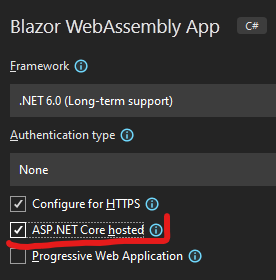
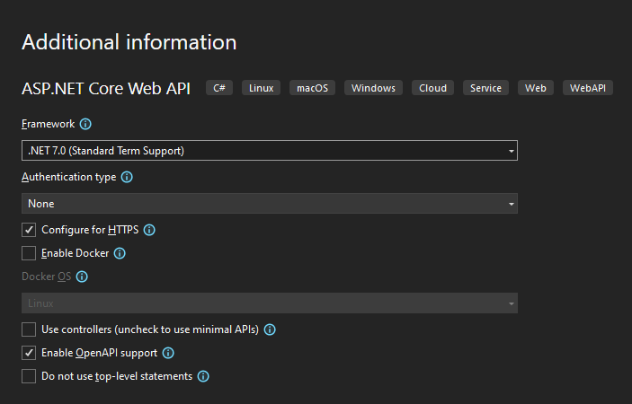

# 05 - Web Api, Swagger, GET, POST, DELETE, PUT


V této lekci vytvoříme novou aplikaci - Web Api. To ve finále bude sloužit k ukládání, správě a posílání dat.

Web Api aplikace běží na serveru a klientské aplikace s ní komunikují pomocí REST API. Api a klientská aplikace (v našem případě Blazor WA aplikace) jsou oddělené a data si vyměňují pomocí univerzálního JSONu. 
Díky tomu je možná spolupráce serverové (Web Api) a klientské části nezávisle na technologiích na kterých jsou postaveny. Serverová část může být napsána v Javě, C#, Pythonu, atd. - stále si bude rozumnět s jakoukoliv klientskou technologií (Blazor, Vue, React,...).

V tomto projektu využíváme C# jak na serveru, tak na klientovi. Přesto budeme aplikace držet odděleně.
Aplikace je možné i provázat, což s sebou přináší nějaké výhody (například možnost pre-renderingu).
Provázanou Blazor aplikace je defaultní template, pokud zaškrtnete při tvorbě Blazor projektu asp.net core hosted.




## sync z minulého cvičení

- GH action automaticky vybírá složku.
- grid pro editaci 
- revize do smajlíku

## Zdroje

- [Tutorial na minimal api v oficiální dokumentaci](https://docs.microsoft.com/en-us/aspnet/core/tutorials/min-web-api?view=aspnetcore-6.0&tabs=visual-studio).
- [Minimal APIs in .NET 6](https://code-maze.com/dotnet-minimal-api/)
- [The simplest way to create an API is with .NET | Minimal APIs (video)](https://www.youtube.com/watch?v=eRJFNGIsJEo) - vřele doporučuji,. 


## Ppt.Shared -> Přidání nového projektu


```ps1
dotnet new classlib -o Ppt.Shared
```

- Ppt.Shared (typu C# class library (nemá to nic moc společného s Blazorem))
  - bude obsahovat věci, které jsou sdílené mezi Clientem a Api. 
- Sem přidejte třídu `VybaveniVm` (nezapomeňte změnit namespace a smazat ji z Blazor projektu)
- Přidejte referenci do Blazor projektu
  - Ve VS přetažením jednoho projektu na druhý nebo
  - úpravou `.csproj` souboru (Ppt.csproj)
  
  ```xml
  <ItemGroup>
    <ProjectReference Include="..\Ppt.Shared\Ppt.Shared.csproj" />
  </ItemGroup>
  ```

- (odstraňte `Class1.cs` v případě, že existuje v Shared projektu (je to pouze templejtová třída, kterou nepotřebujeme))
- Nyní projekt funguje stejně jako předtím.


## Přidání Web Api projektu

V našem případě budeme aplikace spravovat odděleně. Api aplikaci vytvoříme ve složce, kde se aktuálně nachází .sln soubor. Aplikace budou ve stejné složce, ve stejném git repozitáři, ale navzájem o sobě vědět nebudou.

```ps1
dotnet new webapi -minimal -o Ppt.Api
```

Nebo:



Tento příkaz vytvoří v nově vytvořené složce `Ppt.Api` soubory nezbytné k běhu aplikace (vytvoří jich víc, nezbytný je pouze `.csproj` a `Program.cs`)

Struktura v mém případě vypadá takto:

```ps1
Ppt
    ├───Ppt.Client
    │   └───....
    ├───Ppt.Api
    │   ├───bin
    │   │   └───...
    │   ├───obj
    │   │   └───...
    │   ├───Program.cs
    │   │
    │   ├───Ppt.Api.csproj
    │   │
    │   └───Properties
    └───Ppt.Shared
        └───...
```

Přidejte referenci na Shared porjekt. 

Oba projekty - Api i Shared si nezapomeňte přidat do sln ve VS. Add-> Existing Project. Pro běh aplikace to nemá vliv, jenom pro její tvorbu. 

## Spuštění aplikace

Všiměte si parametru `-minimal`. Znamená to, že se vytvoří tzv. minimal web-api. Ve starších verzích .NETu (5 a níž) bylo web api možné postavit na (na první pohled) komplikované struktuře s pomocí kontrolerů. Minimal web-api přichází s velice jednoduchou a uchopitelnou strukturou a veškeré api se dá psát do `Program.cs`. Nese to s sebou i řadu nevýhod. Pro účely výuky je však minimal api dobrou volbou. Můžete vytvoři funkční aplikaci na 4 řádky:

```csharp
var builder = WebApplication.CreateBuilder(args);
var app = builder.Build();
app.MapGet("/", () => "Hello");
app.Run();
```

Nyní se vypíše `Hello` v případě, že vstoupíne na stránku.

V Program.cs je toho však trochu víc:

- Konfigurace swaggeru
- Definovaný get endpoint `weatherforcast`, který vrátí vygenerovanou předpovď počasí. 
- `record`, který je použitý k definovaní dat (nyní si to představte jako třídu, něco podobného jako náš `VybaveniVm`)

### Swagger

Když aplikaci spustíte, spustí se UI swaggeru. Celý swagger slouží k průzkumu vašeho api, můžete se podívat, které endpointy definujete, můžete je zavolat a zkontrolovat data. Swagger poběží jenom v případě, že je prostředí nastaveno na `Development`.

```csharp
if (app.Environment.IsDevelopment())
{
    app.UseSwagger();
    app.UseSwaggerUI();
}
```

Toto nastavení můžete změnit v `launchSettings.json` anebo ho definujete na hostujícím serveru (nastavíte ho na `Production`). Důležité je, že swagger ui se ukáže jenom při vývoji.

## Přidání Shared projektu

- Přidejte do solution již existující projekt Ppt.Shared
- Obsahuje `VybaveniVm`. To je důvod, přoč jsme `VybaveniVm` přesunuli do Shared projektu – můžeme model sdílet napříč serverovou i klientskou částí.

## Vybavení místo počasí (GET)

- V endpointu get vracejte místo počasí seznam vybavení.
- Generátor vybavení přesuňte někam do shared projektu (v mojí implementaci je ve třídě `VybaveniVm`, pod statickou metodou `GetTestList`. Není to uplně nejlepší, ale teď to postačí).
- Vyzkoušejte swagger jestli vrací vybavení.
- Proměnná `seznam` nám nyní poslouží jako "databáze" pro ukládání a mazání vybavení. Přepíše se pokaždé když restartujeme aplikaci.
  - Skutečnou databázi přidáme v následujících hodinách.

```csharp
List<VybaveniVm> seznam = VybaveniVm.GetTestList();

app.MapGet("/vybaveni", () =>
{
    return seznam;
});
```

## POST – přidávání vybavení

- Vytvoříme endpoint na přidávání vybavení

    ```csharp
    app.MapPost("/vybaveni", (VybaveniVm prichoziModel) =>
    {
        seznam.Insert(0, prichoziModel);
    });
    ```

- Endpoint má stejnou adresu, ale jinou metodu (post místo get).
- Pomocí POSTu se prostě něco posílá z klienta na API. Tento endpoint očekává json ve formátu odpovídajícímu třídě `VybaveniVm`. To si můžeme ověřit ve swaggeru, např.:

    ```json
     {
    "name": "string",
    "priceCzk": 10000000,
    "boughtDateTime": "2022-03-22T18:12:56.575Z",
    "lastRevision": "2022-03-22T18:12:56.575Z",
    "isInEditMode": true,
    "needsRevision": false
    }
    ```

- Tento json se namapuje na C# objekt `prichoziModel`, poté je možné s ním libovolně pracovat (například ho přidat do seznamu).

## DELETE – mazání vybavení

- Abychom věděli, který záznam máme z "databáze" smazat, potřebujeme ho nějakým způsobem identifikovat.
  - Nemůžeme to udělat pomocí kontroly všech hodnot (můžou existovat záznamy se stejnými daty)
  - Musíme do `VybaveniVm` přidat unikátní identifikátor

    ```csharp
    public Guid Id { get; set; }
    ```

  - Guid (Globally Unique Identifier) vypadá například takto: `3fa85f64-5717-4562-b3fc-2c963f66afa6`.
    - je to série hexadecimálních číslic.
    - Pokaždé, když se vytvoří nové, tak je unikátní (pravděpodobnost vytvoření dvou stejných guid je extrémně nízká (při generování 1 miliardy guid za sekundu po dobu 36 let je pravděpodobnost kolize pouze 0.00195. [Zdroj](https://stackoverflow.com/a/4878556/1154773).))
  - Díky těmto vlastnostem ho využijeme jako jedinečný identifikátor vybavení.
- Při generování dat vybavení nezapomeňte přidat i `Id`:

    ```chsarp
    Id = Guid.NewGuid()
    ```

- Nyní vytvoříme DELETE endpoint, kerý přijme právě id:

    ```csharp
    app.MapDelete("/vybaveni/{Id}",(Guid Id ) =>
    {
        var item = seznam.SingleOrDefault(x=> x.Id == Id);
        if (item == null) 
            return Results.NotFound("Tato položka nebyla nalezena!!");
        seznam.Remove(item);
        return Results.Ok();
    }
    );
    ```

  - `{Id}` v chlupatých závorkách se namapuje na `Id` v parametru (protože má stejný název).
  - V seznamu se podíváme, jestli existuje nějaké vybavení s takovým id (`SingleOrDefault`).
  - Když ne (bude null - to je to `Default`), endpoint vrátí chybovou hlášku se status kódem 404 (NotFound)
  - Když ano, je vybavení odebráno se seznamu a vrátí se 200 (Ok)
    - A na to by pak Blazor aplikace patřičně reágovala (vymaže ho z UI).

## Dále

### 1)

- Vytvořte PUT endpoint, který se používá k úpravě záznamu.
- Je dosti podobný POSTu
- Ověřte funkcionality pomocí swaggeru.
- (můžete to udělat tak, že smaže předchozí a na jeho místo dá ten s upravenými daty).

### 2)

- upravte POST endpoint tak aby vytvářel v záznamu nové Id (toto je běžný scénář, o ajdýčka se stará databáze, nemůžete je generovat na klientovi). Toto Id posléze vrátí (uvidíte ho ve swaggeru)

### 3)

- Přidejte endpoint, který vrátí pouze jedno vybavení s určitým Id. Standardně se toto využívá k zobrazení detailu a rozšířených informací dané entity. My prozatím žádné rozšířené informace nemáme. Takovouto informací by mohl být třeba seznam oprav daného vybavení. Tento seznam oprav nebudu tahat z databáze při náhledu všech entit vybavení (náročné – na databázi i přenos dat), ale pouze při zobrazení jednotlivého detailu.

