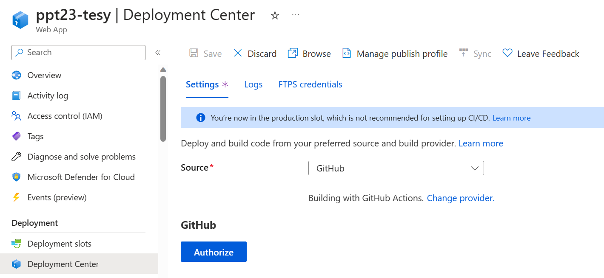
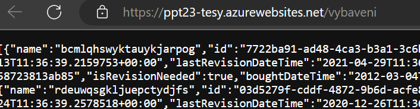

# 08 - nasazení na Azure

## Klávesové zkratky do VS

- `F5` - spusti debugging
- `Shift+F5` - zabije debugging
- `Ctrl+Shift+F5` - zabije debugging a znovu ho spustí (trochu rychlejší, než to mačkat zvlášť)

## Publikování aplikace do Microsoft Azure

- Aktuálně nám funguje pouze publikování klientské aplikace na github pages
- Potřebujeme aby fungovala i serverová část
- Nelze využít github pages - slouží pouze pro statické soubory
- využijeme Microsoft Azure a službu App Service
- Ve finále to bude fungovat takto: pushnete změny, zahájí se 2 github actions: první pro klientskou aplikaci, druhá pro api.
  - klientská aplikace se nasadí na github pages
  - api se nasadí na azure

## Jak dostat aplikaci do Azure

### Publish přes VS

- (pouze informační, takto to dělat nebudeme)
- VS má celkem pěkný průvodce s téměř veškerým nastavením
  - pravým tlačítkem a dáte publish
  - může vygenerovat pubxml soubor, který obsahuje nastavení pro publikaci
    - sestavení aplikace proběhne na vašem stroji a publishnutá aplikace se "pouze" přenese.
    - Výhoda: Je to trochu rychlejší než všechny kroky pomocí gh actions. Nemusíte vytvářet commit
    - Nevýhoda: Nemusíte vytvářet commit (ztrácíte ponětí o tom, jaká verze tam je). Chvilku to trvá (nemůžete u toho vyvíjet, musíte mít zapnutý stroj). Znemožňuje to další devops..
  - Průvodce často končí nějakou chybou, navíc to ne uplně dobře komunikuje se studentským programem na Azure...

### GH Actions 

- vytvoří se commit, na GH actions se apliace zbuildní, pošle se do Azure. Jednoduché, když to funguje. Musí se toho dost nastavit (účel tohoto cvičení).

## Azure App Service

- vytvořte novou App service, zvolte Linux, .net 7 stack, blízkou lokaci (evropu), Free F1 pricing plan. Ostatní věci jsou skoro jedno. 
- aplikaci pojmenujte rozumně dlouhým názvem (já jsem dal `ppt23-tesy`)
  - aplikace poběží na doméně `ppt23-tesy.azurewebsites.net`, nicméně jenom api. Touto doménou se aplikace nikde prezentovat nebude
- Chvíli to trvá, než se aplikace vytvoří

### Spárování s GH

- Nyní je třeba dostat kód, který máte na gh, do app service.
- V App service ->  Deployment Center -> Github, autorizujte aplikaci, zvolte repozitář.
- Azure app service použije přihlášení k tomu, aby přidala na GH secret s Publish profilem a vytvořila .yml soubor (a taky ho commitne a pushne)

- vytvořený .yml je dost podobný tomu který už máme.
- Soubor je potřeba upravit - upravte na gh, nebo si změny stáhněte na lokál.
  - změňte cestu na api projekt
  - inspirujte se v mém projektu.
- Nyní při pushnutí změn se spustí GH action. 
- Celá magie deploymentu je zde: 

  ```yml
  - name: Deploy to Azure Web App
        id: deploy-to-webapp
        uses: azure/webapps-deploy@v2
        with:
          app-name: 'ppt23-tesy'
          slot-name: 'Production'
          publish-profile: ${{ secrets.AZUREAPPSERVICE_PUBLISHPROFILE_149216E4ABF7441EBDB923AB95194FB0 }}
          package: .
  ```

  - využije se akce `azure/webapps-deploy`, v publish-profile jsou všechny důležité informace k publikování (včetně tokenů pro autentifikaci)
    - proměnná `secretes` značí zabezpečené úložišt na GH (settings/secretes/actions, pro můj repo https://github.com/tesar-tech/ppt_23/settings/secrets/actions)
    - Díky tomuto mechanismu může být celá pipelina dostupná světu aniž by došlo k nějakému úniku přístupových údajů.
- Každá pipelina má nyní jiný projekt k buildění. `Client` projekt je pro GH pages, `Api` projekt je pro Azure. Změňte projekt i v `Client` pipelině, pokud jste tak neudělali.
- Že je Api aplikcae správně nasazená poznáte, že přistoupíte na její doménu/vybavení (např. https://ppt23-tesy.azurewebsites.net/vybaveni ). Mělo by to kontaktovat Get endpoint vybavní a vrátit json, který prohlížeč zobrazí.
   
- Blazor aplikce nasazané na GH pages však nezná API url a nemůže tedy s api komunikovat. To vyřešíme příště. 
