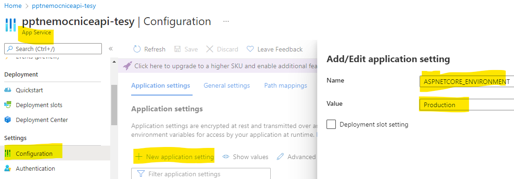

# 09 - Propojení aplikací na Azure a GH pages

> DRAFT

## Úpravy aplikace - appsettings, ASPNETCORE_ENVIRONMENT

- Aplikace (blazor a api) jsou na sobě nezávislé. Vědí o sobě jenom tím, že:
  - api CORS dovoluje origin Blazor aplikace ("aplikaci s tímto url budu zpracovávat požadavky")
  - Blazor aplikace má nastavenou adresu api ("tu odesílej požadavky přes HTTP klienta")

### Přenastavení CORS

- Aktuálně máme CORS nastavený tak, aby propouštěl požadavky z domény localhostu: 

  ```csharp
  builder.Services.AddCors(corsOptions => corsOptions.AddDefaultPolicy(policy =>
      policy.WithOrigins("https://localhost:7132")
  ```

- Nicméně klientská aplikace nám běží na github doméně `https://tesar-tech.github.io`
- Jak rozlišit, že je aplikace nasazená (a povolit origin githubu.io) nebo, že je ve vývoji a povolit origin localhostu? 
- Aplikace to dokáže rozlišit pomocí `ASPNETCORE_ENVIRONMENT`. Napříkad zde:
  - swagger použijeme jenom při vývoji

    ```csharp
    if (app.Environment.IsDevelopment())
    {
        app.UseSwagger();
        app.UseSwaggerUI();
    }
    ```

- Jak aplikace pozná, že je v `Development`?
  - řekli jsme jí to v launchSettings.json :  `"ASPNETCORE_ENVIRONMENT": "Development"`
  - dalším prostředím je `Staging` a `Production`.
- Nasazené aplikaci "vnutíme" Production.
  - launchSetting.json se při publikování aplikace na server nedostane
  - řekneme jí to v Azure s pomocí konfigurace (tento krok dělat nemusíme, jelikož `Production` je [defaultním nastavením](https://docs.microsoft.com/en-us/aspnet/core/fundamentals/environments?view=aspnetcore-6.0#azure-app-service))
    
  - Nyní můžeme používad odbočku `app.Environment.IsProduction()`
  - Nicméně je lepší používat appsettings.json konfiguraci:

### appsettings.json

- v api projektu vidíte soubor appsettings.json a appsettings.Development.json
- Fungují tak, že dle prostředí se použije dané nastavení (například Development) a když některé nastavení není v Development, použije se to z appsettings.json.
- Tedy do appsettings.json dáváte konfiguraci, která je nezávislá na prostředí.
- Vytvořte produkční app settings a umístěte tam konfiguraci AllowedOrigin s hodnotou vaší github pages domény. (origin je bez cesty a lomítka na konci)
- To stejné udělejte pro development.
- Konfiguraci si v Program.cs vyzvednete pomocí: `builder.Configuration["AllowedOrigins"]`
  - vyzkoušejte, že vám to funguje

### Přenastavení adresy api na klientovi

- Stejný "problém" s natvrdo vepsaným nastavením máme i na straně klienta.
- Nastavujeme zde URI pro komunikaci s api.
- přidejte `appsettings.json` (a jeho `Development` a `Production` varianty) do `wwwroot` složky.
  - přidejte patřičné nastavení. 

- Otestujte aplikace, poté je pushněte...

## Některé nedostatky

- Popsané problémy s sqlite databází.
- Build a nasazení aplikací je nezávislý proces. Může to dojít do nešťastné chvíle, kdy se změny projeví jen v jedné aplikaci. Druhá se kvůli chybě třeba nesestaví.
  - Máme pak api nekompatibilní s klientskou aplikací do doby, než problém vyřešíme. To je špatně.
- Měl by existovat Staging. Stejná aplikace (se stejným nasatavením) na azure s vlastní databází, kde se celý proces otestuje.
- Mělo by existovat víc větví, než jen jedna (master). Jedna zvlášť na vývoj, na testování, různé verze atd...
- Aplikace by měla obsahovat automatizované testování. Testy se pak spouští před každým nasazením aplikace, díky tomu se odhalí část problémů (které by se jinak odhalili až za běhu).
  - Se složitostí aplikace roste potřeba testů (vývojáři si přestávají pamatovat co kde je s čím propojené a co se kde v důsledku této a této změny může pokazit...)
  - K tomu jsem se bohužel v předmětu nedostali.
- Aktuálně využívaná App service na azure startuje pomalu. Aplikace běží zdarma a jedním z omezení je i pomalý studený start..