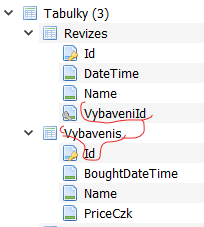

# 12 Data Seed, Revize, Vybavení 1:N Revize

V tomto cvičení naplníme databázi daty při spuštění aplikace. Přidáme revize k vybavení a upravíme UI a endpointy, aby byly schopny pracovat s novou strukturou.

## Data Seed

- Do databáze se přidají testovací data, tak abychom aplikaci neotevírali prázdnou.
- Jednou z metod jak je tam dostat je upravit metodu `OnModelCreating` v DbContextu
  - vyžaduje i specifikování Id, umožňuje mít v db přesně data která potřebujete.
  - data se tam přidají při migraci (stane se součástí migračního souboru)
  - je to trochu "hloupé". My bychom chtěli zkontrolvat data při každém spuštění aplikace ne jenom, když jsou k dispozici migrace.
- Uděláme vlastní třídu `SeedingData` ve složce `Data`.
- Přes constructor injection ji předáme `PptDbContext`, tak abychom měli přístup k databázi.
- Vytvoříme metodu `SeedData`
  
  ```csharp
      public async Task SeedData()
    {
        if (!_db.Vybavenis.Any())//není žádné vybavení - nějaké přidáme
        { 
            // vytvoř x vybaveních
           //.. přidej do db
        }

        await _db.SaveChangesAsync();
    }
  ```

  - Můžete použít vrácení náhodného seznamu z `VybaveniVm` a pomocí Mappsteru vytvořit instance modelu (třída `Vybaveni`), kterou pak přidáte do db.
  - Při vkládání do db musí být Id prázdná (například moje aktuální implementace metody `VratSeznamVybaveni` toto nemá, s tím si musíte poradit)
- `SeedData` metodu zavoláte téměř na konci před voláním `app.Run();`
  - `await app.Services.CreateScope().ServiceProvider.GetRequiredService<SeedingData>().SeedData();`
  - Musíte mít ale `SeedingData` přidanou v `Services`  (`...AddScoped<SeedingData>();`) abychom ji mohly ze ServiceProvidera dostat.
- Teď by se nemělo stát, že při spuštění aplikace bude výpis vybavení prázdný. 


## Spojení vybavení a revizí

Z předchozího cvičení byste měli mít přidanou tabulku (třídu) `Revize` s vlastnostmi `Id`,`Name` a `DateTime`. Tyto revize efektivně nahradí vlasnotst `LastRevisionDateTime` a umožní udrřovat list revizí.

Nyní jsou revize a vybavení dvě nezávislé tabulky. Spojte je relací 1:N:

- Na jedno vybavení připadá několik revizí.
- Každá revize je záznamem revize právě jednoho vybavení. 
- Tento vztah vytvořte pomocí C#, EF si to přebere a vytvoří správnou databázovou relaci.

```csharp
//Vybaveni.cs
//public DateTime LastRevisionDateTime { get; set; } //není potřeba, už je to ve Revizes
public List<Revize> Revizes { get; set; } = new();

//Revize.cs
public Guid VybaveniId { get; set; }
public Vybaveni Vybaveni { get; set; } = null!;
```

- Do Revizí přidejte propertu `DateTime` (pokud nemáte)
- Přidejte migraci
  - updatovat db nemusíte, to provede sama aplikace (pokud jste implementovali cv 11)

  

## Úpravy nezbytné pro fungování apliace s propojenou revizí a vybavením
  
- Ve výpisu Vybavení (Vybaveni.razor) se bude zobrazovat datum poslední revize. Nicméně vlastnost `LastRevision` není v tabulce `Vybaveni`. Musíte ji proto získat jako poslední revizi k patřičnému objektu Vybavení. 
  - Upravujete endpoint, konkrétně jak do `VybaveniVm.LastRevision` dostanete kýžené datum
  - klient v tomto případě zůstává stejný
- Lehce upraven musí být i endpoint z získání detailu Vybavení. V detailu zobrazíte všechny patřičné revize. Je ptoto nutné vytvořit si novou třídu `VybaveniSRevizemaVm` (tu budete vracet v getu na detail vybavení).
- `LastRevision` ve `VybaveniVm` bude nullable. To je pro případ, že žádná revize prozatím neexistuje.
- Musíte vhodně zobrazit neexistující revizi (tam kde to bude potřeba)
- Změny dozná soubor `VybaveniRow`, který například bude vytvářet novou revizi (a volat endpoint, který novou revizi odešle do databáze.)
  - Musíte tedy upravit/přidat patřičné endpointy pro revizi.
  - Na každé kliknutí tlačítka Přidej Revizi se přidá jedna do databáze (s aktuálním časem)
  - Budou pak vidět na výpisu ve `VybaveniDetail`
- Vhodně upravde `DataSeed` tak aby vytvořil i nějaké revize.